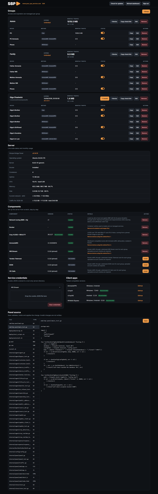

<p align="center">
  
</p>

<p align="center">
  <strong>Your server. Your software. One panel.</strong>
</p>

<p align="center">
  <a href="https://github.com/silenceremember/sbp-panel/releases/latest"></a>
  <a href="https://github.com/silenceremember/sbp-panel/actions/workflows/release.yml"></a>
  <a href="LICENSE"></a>
  
</p>

<p align="center">
  <a href="https://boosty.to/silenceremember"></a>
  <a href="https://t.me/someshitnobodyaskedfor"></a>
  <a href="https://discord.gg/6k8W8e7p8Z"></a>
</p>

# Simple Bridge Panel

SBP is a small self-hosted panel for preparing and managing a fresh Ubuntu VPN server. It installs supported components, creates client profiles, manages access and expiration, tracks current-month traffic, and performs health-checked updates from one dashboard.

SBP is not a VPN provider or hosted service. It manages third-party software on **your own server**.

## What it manages

- Server components and their lifecycle.
- Groups, expiration, devices, credentials, and QR profiles.
- Xray TCP, Xray XHTTP, and AmneziaWG access.
- WB Stream, Yandex Telemost, DION, and VK Calls routing rooms.
- CPU, memory, disk, uptime, network, and monthly traffic estimates.

## Panel preview

Groups, devices, traffic, server health, components, and credentials all live on one dashboard. The screenshot is tall because the panel keeps everything in one place.

<details>
<summary><strong>Open the full panel screenshot</strong></summary>

This example is from an earlier release, so some labels and versions may differ from the current build.

<p align="center">
  <a href="docs/panel-preview.png">
    
  </a>
</p>

</details>

## Components

| Component | Version | Purpose |
|---|---:|---|
| Network tuning | v1 | BBR with the `fq` queue discipline |
| Docker | Ubuntu package | Isolated managed services |
| [Xray](https://github.com/XTLS/Xray-core) | 26.3.27 | VLESS over TCP with REALITY and XTLS Vision |
| [Xray](https://github.com/XTLS/Xray-core) XHTTP | 26.3.27 | VLESS over XHTTP with REALITY |
| [AmneziaWG](https://github.com/amnezia-vpn/amneziawg-go) | 3.1.20260814 | AmneziaWG server and device profiles |
| [Whitelist Bypass](https://github.com/kulikov0/whitelist-bypass) | 0.3.8 | WB Stream, Telemost, DION, and VK Calls |

SBP provides a management layer around these upstream projects; it does not create or own their protocols.

## Requirements

| Item | Requirement |
|---|---|
| Server | Fresh Ubuntu 24.04 LTS, Linux amd64 |
| Access | Root or sudo over SSH |
| Network | Directly reachable public IPv4 address |
| Minimum | 1 vCPU, 1 GB RAM, 10 GB SSD |
| Recommended | 2 vCPU, 2 GB RAM, 20 GB SSD for all components or several users |

| Port | Protocol | Used by |
|---:|---|---|
| 9443 | TCP | SBP panel |
| 443 | TCP | Xray |
| 28443 | TCP | Xray XHTTP |
| 48692 | UDP | AmneziaWG |

> [!IMPORTANT]
> SBP 1.x is installed on a fresh server and does not upgrade 0.x installations. Existing VPN software, containers, occupied ports, or custom networking may be detected as external and will not be adopted or removed.

## Install

Connect to the server over SSH and run:

```bash
curl -fsSL https://raw.githubusercontent.com/silenceremember/sbp-panel/main/install.sh | sudo bash
```

Enter the administrator password twice, then open:

```text
https://YOUR_SERVER_IP:9443
```

| Login detail | Value |
|---|---|
| Username | `admin` |
| Password | The password entered during installation |
| Certificate | Self-signed by default; the browser shows a warning on the first visit |

## First setup

1. Open **Components** and install Network tuning, Docker, and the VPN methods you need.
2. Upload authorized cookie JSON under **Service credentials** if routing integrations are required.
3. Create a group and choose an expiration date or unlimited access.
4. Add a device and select its connection method.
5. Copy the profile or scan its QR code and import it into a client.

Profiles use the readable name `SBP · Group name · Device name`. Routing integrations create one shared room for each group and provider.

| Profile type | Suggested client |
|---|---|
| Xray TCP or XHTTP | [v2rayN](https://github.com/2dust/v2rayN) for Windows; [v2rayNG](https://github.com/2dust/v2rayNG) for Android |
| AmneziaWG | [AmneziaVPN](https://github.com/amnezia-vpn/amnezia-client) |
| Routing integrations | [Whitelist Bypass](https://github.com/kulikov0/whitelist-bypass) |

## Operations

| Action | Command or UI | Result |
|---|---|---|
| Update SBP | `sudo sbp-panel-update` or **Check for updates** | Checks stable releases by default, verifies size and SHA-256, checks health, and rolls back on failure |
| Try prereleases | Enable **Pre-release** beside **Check for updates** | Immediately scans stable and GitHub prerelease builds; the command-line updater stays stable-only |
| Remove the panel | `sudo sbp-panel-uninstall` | Removes SBP and its panel data, but leaves managed components running |
| Return to a clean server | Remove components in the dashboard, then uninstall SBP | Removes panel-owned components in safe dependency order before panel removal |

## Operational behavior

| Area | Behavior |
|---|---|
| Device changes | Xray and AmneziaWG credentials are applied live without restarting shared containers |
| Component isolation | Xray TCP and XHTTP use separate containers, ports, configs, and traffic namespaces |
| Expiration | Expired groups are reconciled with runtime credentials and routing access |
| Routing | One room is shared by each group and provider, not each device row |
| Traffic | Current UTC month only; operational estimates, not billing records |
| Persistent state | No historical traffic archive, automatic backups, editable source tree, or build toolchain |
| Logs | Persistent managed Docker logging is disabled; SBP services do not write persistent application logs |
| Administration | One fixed administrator account, no password recovery flow; administrator access is root-capable |

<p align="center">
  
</p>

## FAQ

| Question | Answer |
|---|---|
| Is "SBP Panel" technically "Simple Bridge Panel Panel"? | Yes, a bit like "PUBG: Battlegrounds." The product is Simple Bridge Panel; `sbp-panel` is still the repository and command name. |
| What does SBP stand for? | Simple Bridge Panel. Suspiciously Big Pizza is also an acceptable answer. |
| Is SBP a VPN provider? | Nope. It helps you manage supported software on your own server. |
| What remains after panel uninstall? | Managed components keep running on purpose. Remove them in the dashboard first if you want a clean server. |

## Contributing

Found a bug, have an idea, or see something that could be clearer? Issues, diagnostics, documentation fixes, tests, and focused pull requests are all welcome.

Thinking about making a fork? Please consider contributing here first. One stronger project is easier for everyone to use and maintain.

Never submit real server addresses, cookies, private keys, client credentials, databases, or session data.

SBP uses Go 1.26.7:

```bash
gofmt -w .
go test ./...
bash deploy/test_scripts.sh
```

## Versioning

| Version | Meaning |
|---|---|
| `0.0.1` | A compatible fix or small polish update |
| `0.1.0` | A backwards-compatible feature release |
| `1.0.0` | The first deliberately reviewed major baseline; later major changes may break compatibility |

Testing builds keep an ordinary numeric version and are marked **Pre-release** on GitHub. They are working builds you can use while real-world testing finds the remaining issues. After the observation period, that GitHub release can be promoted to stable, or a newer numeric prerelease can be published.

## Plans

| Priority | What it means |
|---|---|
| Everyday use | Keep setup, updates, and routine management as simple as possible |
| Reliability | Fix real problems, improve recovery, and keep existing installations predictable |
| Compatibility | Maintain the supported components and Ubuntu 24.04 target without vague promises |
| New ideas | Add larger features only when people have a practical need for them |

### Planned projects

| Project | Idea |
|---|---|
| SBP Linker | Bring several SBP servers together in one place and make larger deployments easier to manage |
| Telegram bot | Handle payments, renewals, and automatic access delivery |
| SBP VPN client | Keep connections produced by SBP across supported protocols together in one simple app |

## Third-party software

SBP integrates with [Xray-core](https://github.com/XTLS/Xray-core), [AmneziaWG](https://github.com/amnezia-vpn/amneziawg-go), [AmneziaVPN](https://github.com/amnezia-vpn/amnezia-client), [Whitelist Bypass](https://github.com/kulikov0/whitelist-bypass), [v2rayN](https://github.com/2dust/v2rayN), and [v2rayNG](https://github.com/2dust/v2rayNG).

Their names, trademarks, software, and services belong to their respective owners and remain governed by their own licenses and terms. Inclusion does not imply affiliation or endorsement.

## License

Decided to fork SBP or use some of its code elsewhere? Please include a link to the [original project](https://github.com/silenceremember/sbp-panel). Other than that, it is the standard [Apache License 2.0](LICENSE) - keep the license and attribution from [NOTICE](NOTICE) where required.
